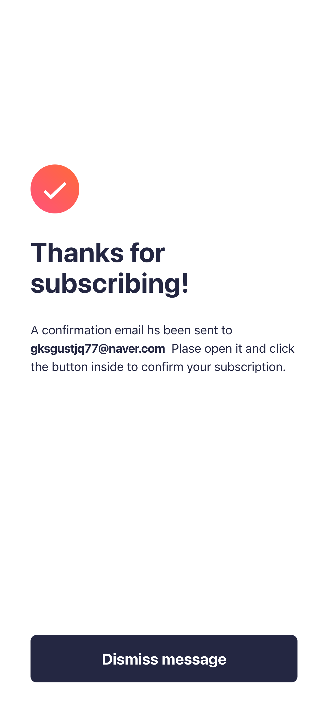

# React + TypeScript + Vite

## 📸 Preview

## Live site

- **Vercal**: https://newsletter-sign-up-with-success-mes-one.vercel.app/

## PC 💻

## Phone 📱

  
  
  

## 기술 스택 📚

- **Frontend**: React, TypeScript, Tailwind CSS
- **상태 관리**: useState
- **툴링**: Vite, ESLint, Prettier
